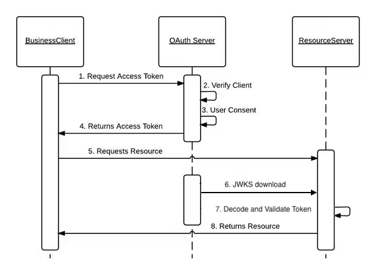

## Requirements and Tech Stack
- Rails 7.1.3
- Node 20.9.0
- NextJS 14.1
- ReactJS 18
- Auth0 Authentication (account required)
- SQLite 3

## Getting Started

First, create the `backend/.env` and `frontend/.env.local` files by filling in the values from `.env.example`. This demo is prepared to automatically create random data.

```bash
# Fast way to start the stack
docker compose up -d
# To see execution logs meanwhile
docker compose logs -f
# Wait for the database to seed, then go to http://localhost:4000
```

## Caveats

- I've developed this as quickly as possible; there are probably a few things to improve in terms of quality. Please don't focus too much on this aspect.
- I've tried here to demonstrate all my capabilities, coding as though this were a larger project. To be clear, I prefer to avoid overengineering.
- Testing is pending. I would focus on the critical code and main business logic.
- My main focus has been on Multi-tenant IAM (Organization entity) with a separate database schema for every organization.
- I did not focus on the UI design.
- I had to implement schema-based multi-tenancy in the backend without libraries, as the `ros-apartment` gem for Rails 7 is not working properly, and the `act_as_tenant` gem is row-based.

## Next Development Steps

- Cover mainly `Auth0Client`, `Secured`, `Tenantable` on the Backend, and `actions.js`, `metrics/page.js`, `lib` on the Frontend with tests.
- CRUD for Metrics is not implemented, only listing averages.
- Implement authorization based on RBAC or ABAC (Auth0 Extension already enabled).
- Add a User model in the backend to extend information related to Auth0 user identity.
- Integrate the backend with the Auth0 Admin API, for example, 
to list organizations to dynamically generate database tenants on the backend or theme config in the frontend.
- Create a signup form.

## Architecture Decisions

- Why Auth0? 
    + Multi-organization support: In this solution, all users 
  are under the same Auth0 tenant/account, and you can include them in specific organizations,
  allowing users to choose their organization before or after login. This setup is probably the most common case in many SaaS products.
    + The previous solution could be the best, but for instances like on-premise solutions,
  we might need to create separate Auth0 tenants with isolated users. This can be achieved 
  by provisioning new instances automatically integrated with the Auth0 Admin API.
    + I have experience with it. There are many documents and libraries, and it's easy to integrate.
    + It's highly customizable.
  
##### User Authentication Flow


##### API Auth Flow


- Why NextJS and not only ReactJS?
  + For security reasons, I prefer NextJS. With Next, we can authenticate 
  on the server first before executing anything on the client. In a common React app, all the code is downloaded, 
  including all environment variables. However, Auth0 is prepared for SPAs, and it's possible to use only React as well.
  + Another reason is NextJS's caching features, rendering optimizations, and better SEO for those concerned with it. :)
  + It offers powerful and flexible options for executing code on the server or the client in a transparent manner. 

- Why schema-based multi-tenancy?
  + Time is one of the main reasons for a demo project like this. It's easier to implement,
  requires simpler infrastructure, only one instance of the backend needed.
  + For some cases, as mentioned before, replicating infrastructure is better.

- Backend architecture and pattern designs
  + Within the `app` directory, there is a `domains` path designed to follow Domain-Driven Design principles. 
  This path is intended for all business logic that does not fit within models, applying the right pattern design for each problem.
  Models should primarily be reserved for data-related logic and adhere to the principle of single responsibility (SOLID principles).
  
For more complex cases, let's talk!

